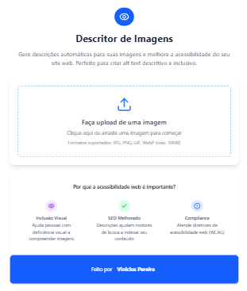
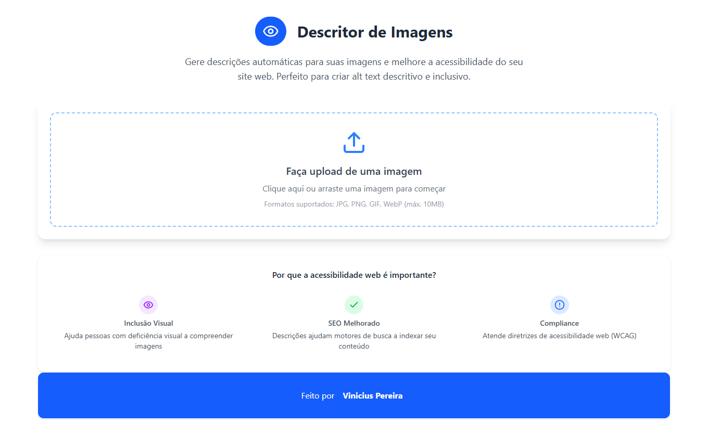

# 🖼️ Image Description AI

  
Aplicação Web que permite ao usuário enviar uma imagem e receber uma descrição automática gerada por Inteligência Artificial.

## Acesse a versão online hospedada na Vercel:

[](https://image-description-one.vercel.app/)

---

## 🚀 Funcionalidades

- 📤 Upload de imagem local
- 🧠 Análise de imagem com IA
- 💬 Geração de descrição automática
- 💡 Interface limpa e intuitiva

---

## 🛠️ Tecnologias Utilizadas

- ⚛️ **React** - Biblioteca Javascript
- ⚡ **Vite** - Build tool 
- 🎨 **Tailwind CSS** - Framework CSS 
- 🚀 **Vercel** - Deploy e hospedagem
- 🤖 **Gemini Vision API** - Análise de imagens com IA
---

## 🖼️ Preview

  

---

## ⚙️ Como Rodar Localmente

```bash
git clone https://github.com/ViniciusGCP94/image-description.git
cd image-description
# Abra o arquivo index.html no navegador

⚠️ Observação: Para que a IA funcione localmente, você precisará de uma API Key da Gemini Vision, e configurar corretamente a requisição fetch.
```

---

## 📚 Sobre o Projeto
Este projeto demonstra como integrar aplicações front-end com APIs de inteligência artificial para análise e descrição de imagens. Um ótimo exemplo prático do uso de visão computacional na web.

---

## 🔐 Como obter uma API Key da Gemini
1. Crie uma conta no Google AI Studio.

2. Ative o modelo Gemini Vision.

3. Gere uma chave de API.

4. Insira a chave no cabeçalho da requisição fetch no seu JavaScript.

---

## 🙋‍♂️ Desenvolvedor
[Vinícius Pereira (Vinnie)](https://github.com/ViniciusGCP94)

Desenvolvedor Front-End em transição de carreira.

---

## 🤝 Contribuições
Contribuições são bem-vindas!
Abra uma issue ou envie um pull request.

---

## 📄 Licença
Este projeto está sob a licença MIT.
Veja o arquivo [LICENSE](./LICENSE) para mais informações.